# User Guide

## User Story 1

***As a user, I want to access advanced search filters (e.g., by date, user, or tag), so that I can find specific posts more efficiently.***

**Status:** Incomplete

**Progress:** The only thing we were able to achieve for this specific user story is the frontend portion of the advanced search.

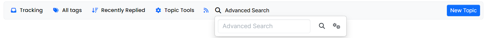

**Reason:** The main person working on this issue was very busy throughout the entirety of this sprint, and this is an incredibly difficult issue. We realized that we may not be able to achieve this issue, which is why we only have the front end for the issue. We also shifted our focus from this issue to Anonymous mainly since that issue seemed more possible to complete compared to this one. The midterm was another reason we had to pause development.

## User Story 2

***As a student, I want to search for questions and answers using keywords, so that I can find relevant information quickly.***

**Status:** Incomplete

**Progress:** We were able to create a search bar with a button to allow the user to insert a word to search. 

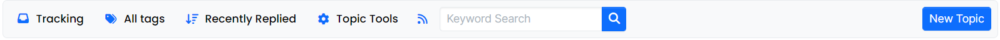

One might wonder, why did we create one search bar for advanced search and one search bar for keyword search. Well, different people worked on both issues, and both needed to create a front end. We then agreed that the advanced search bar is more slick, which is why we kept it, however, a pull request was created for the front end of the keyword search even though we did not merge it to f24.

We did also create a couple of files, namely `src/posts/search.js` and `public/src/client/topic/lists.js`. These two files were attempts at connecting the front end portion with the back end. They were meant to be files for the actual searching (search.js) and files for displaying the list of topics themselves after conducting the search (lists.js).

**Reason:** We were trying to take inspiration from the searching for groups or users, and we were trying to figure out how they function. We kind of got an idea of how they work but it was fairly complex and, interestingly enough, user and groups search function in a different way (at least from what we understand). This made it even more difficult to try and integrate keyword search into NodeBB. The midterm was another reason we had to pause development. At the end of the day, there was an attempt to modify the back end for the actual searching to occur and what topics to display after the search occurs.

## User Story 3

***As a student, I want to make posts anonymously, so that I can feel comfortable using the application***

**Status:** Complete

**How To Test New Feature As a User:**

- Log in to NodeBB
- If you are not logged in it looks like this in the top right of the page:

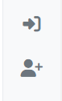

- Once you have logged in, it should look something like this:

- Enter one of the categories available here by clicking on one of them:

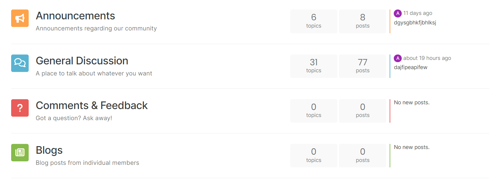

- Create a new topic:

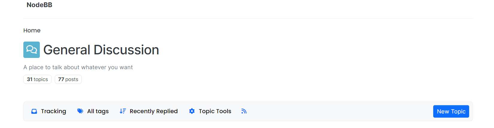

- You should get an interface that looks like this:

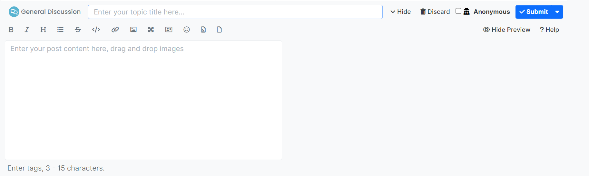

- Enter a topic title, post content, and make sure to toggle the Anonymous option

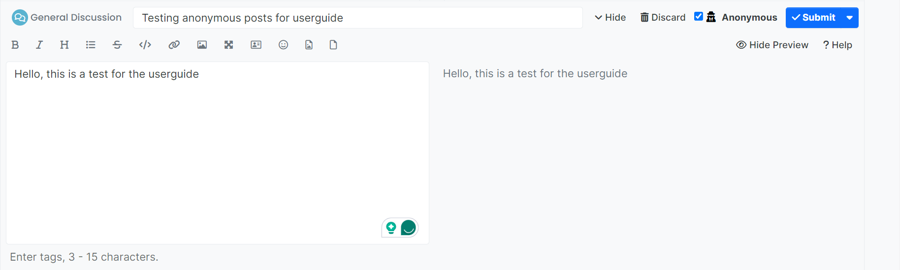

- Submit the topic

- You should see the topic pop up like this:

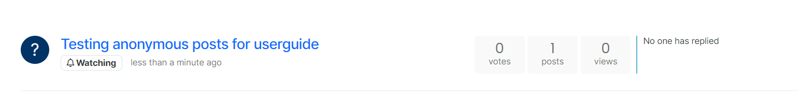

- If it does not pop up, try refreshing the page
- The user can open the post and inspect everything, it should be a completely anonymous post. 
- The user should also be able to reply anonymously within the topic itself:

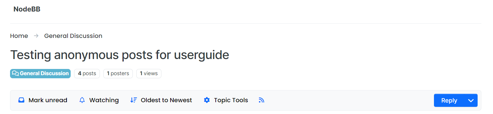

- Just to showcase that each post is **not** stuck on Anonymous, here's a reply in the topic we just created without the Anonymous option toggled

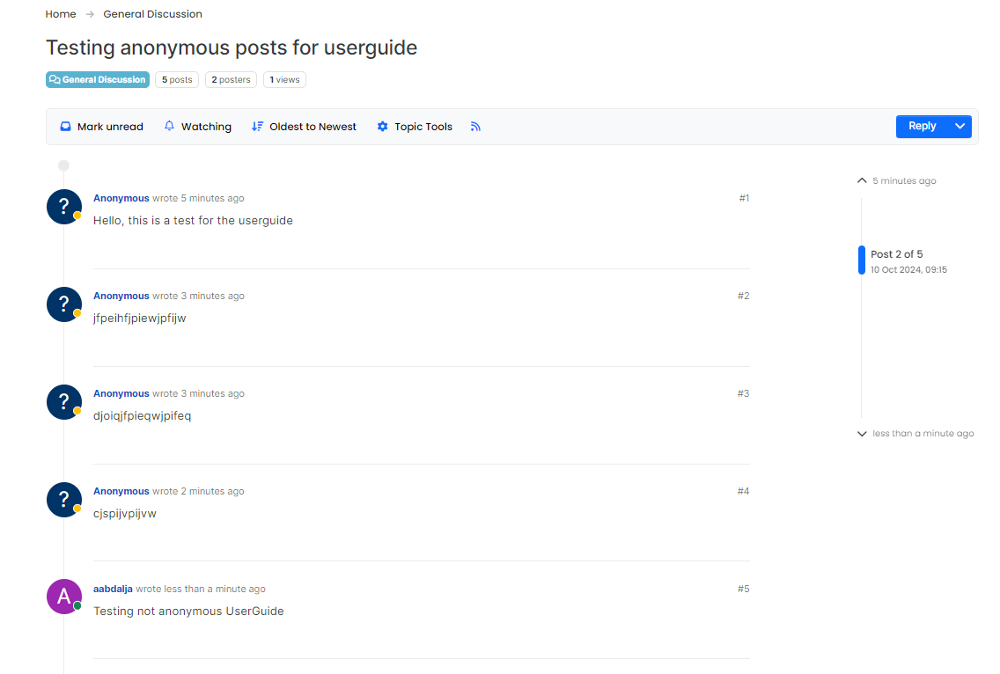

- That should be it for testing the functionality of anonymous posts as a user

**Automated Tests:**

Location: `test/topics.js`. The actual tests should be between lines 2,506 and 2,565. 

What is Being Tested: In terms of what is exactly being tested, the tests we added first setup the users again, log in to an admin user, create a category (such as General Discussion), and create a template for a topic. After all the setup, the tests create a topic as an admin user while the anonymous parameter is false. It then makes sure that the username and display name of the user is 'admin 0'. It also checks that the user id is a normal number like 3 in this situation. This test is to display the fact that the topic is normal when the anonymous parameter is false. 

The following test does the exact same thing except the fact that the anonymous parameter is true. It then checks that the username and the display name of the user is 'Anonymous'. Additionally, it checks that the user id is 0, since the way we add this new feature is we change the user id of the user that wants to post anonymously to 0 in the back end. This test shows off the fact that our anonymous posts feature functions the way it is supposed to. 

These tests should be sufficient because they test the two possible scenarios which are, a user wanting to post **not anonymously** and a user wanting to post **anonymously**.

## User Story 4

***As a user I want to be able to post and be able to include a poll to see how my classmates feel about what I asked***

**Status:** No Progress At All

**Reason:** This user story was one of our early ideas, however, we realized early on that this might be too difficult of a user story to try and complete. The reason it is being mentioned here is, the issues related to the poll for posts are still on our Kanban board, which is why we thought we would explain it here. Ultimately, we decided to discard this user story completely, but it still remains on the Kanban board in the completed section even though we closed all the issues as 'unplanned'.

## User Story 5

***As a forum user, I want to set custom notifications for specific types of interactions (e.g., only for posts/replies, not likes or upvotes), so that I can manage how frequently I receive alerts.***

**Status:** Incomplete 

**Progress:** This user story is quite interesting as have been able to make some progress even though it is **not** consistent with functionality. We modified `public/src/client/topic.js` and added a portion of code that is meant to notify a user that a new post was created when they create a new post/topic. The interesting thing about the code we did add, is that it only **sometimes** functions. As in, it rarely notifies the user when they create a post even though it should notify the user **everytime** they create a post. We have no idea why this occurs, but that was our situation by the end of Sprint 2. Additionally, I believe we had a different idea associated with this user story initially, but it changed over time. It might have been something associated with setting custom notifications for things like posts or replies, however, we ended up trying to create a notification for every post made by the user since we realized it was more complex than we thought.

**Reason:** We could not progress when it comes to mentions (a user mentioning another user in a post) and making it function consistently due to the midterm and other needs that group members needed to attend to. It is also quite complex generally, which made it difficult to work on. In addition, we were indecisive when it comes to what we wanted with this user story, which is why we kind of pushed it to the side a bit after Sprint 1 to focus on Anonymous more since that seemed like a doable user story.

Here is an example of it working. The notification appears in the bottom right:

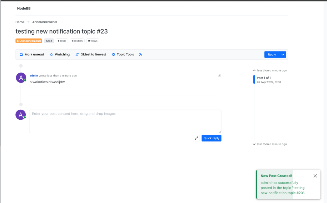